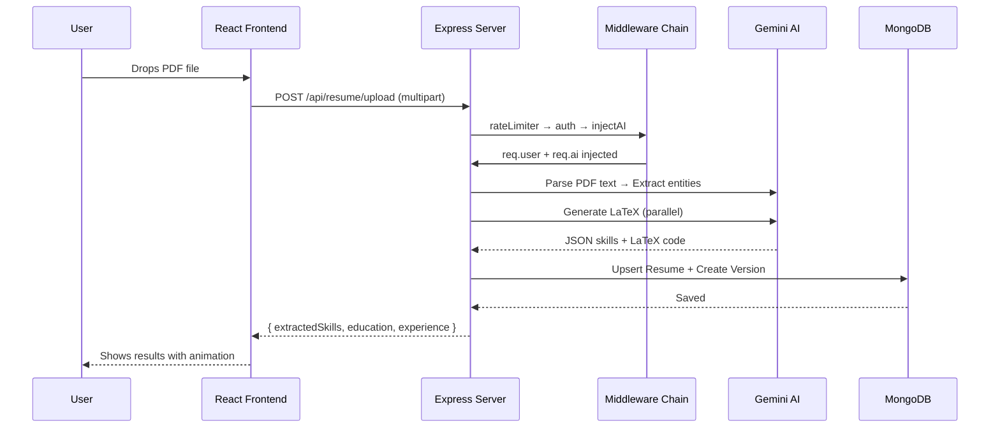

# CareerLens 🎯

<div align="center">
  <p><strong>An AI-powered career optimization platform that helps software engineers craft ATS-friendly resumes, tailor them to specific job descriptions, and generate professional cover letters — all in seconds.</strong></p>
  <p>🚀 <strong>Live Demo: <a href="https://career-lens-vert.vercel.app" target="_blank">career-lens-vert.vercel.app</a></strong></p>

  
  
  
  
  
  
  
</div>

---

## 📖 Table of Contents

1. [The Problem We Solve](#-the-problem-we-solve)
2. [Key Features](#-key-features)
3. [System Architecture](#️-system-architecture)
4. [Scalability — Handling 10 Lakh+ Users](#-scalability--handling-10-lakh-users)
5. [Tech Stack](#-tech-stack)
6. [Project Structure](#-project-structure)
7. [Database Schemas](#-database-schemas)
8. [API Reference](#-api-reference)
9. [Getting Started](#-getting-started)
10. [Environment Variables](#-environment-variables)
11. [Future Roadmap](#-future-roadmap)
12. [License](#-license)

---

## 💡 The Problem We Solve

The modern hiring pipeline is broken for candidates:

- **ATS Rejection** — Over 75% of resumes are rejected by Applicant Tracking Systems before a human ever sees them, because of bad formatting, missing keywords, or non-standard layouts.
- **One-Resume-Fits-All** — Job seekers send the same generic resume to every company, missing the chance to highlight relevant skills for each specific role.
- **LaTeX Complexity** — Professional LaTeX resumes look great but require hours of manual formatting that most candidates don't have time for.
- **Cover Letter Fatigue** — Writing a unique cover letter for each application is time-consuming and repetitive.

**CareerLens** solves all of this by combining AI-powered resume analysis, automated LaTeX generation, JD-specific tailoring, and cover letter generation into a single, beautiful platform.

---

## ✨ Key Features

### 1. 📄 Intelligent Resume Parsing & Extraction
Upload your existing resume as a PDF. Our AI (Google Gemini) reads the unstructured text and extracts a structured JSON representation:
- **Skills** — Programming languages, frameworks, tools
- **Education** — Degrees, institutions, dates
- **Experience** — Companies, roles, achievements
- **Projects** — Side projects with tech stacks

> **Why?** Manual data entry is tedious. By auto-extracting entities, we can instantly populate the LaTeX builder, the profile page, and the analysis engine — all from a single upload.

### 2. 🔍 AI Resume Analyzer (Improve Mode)
Get an expert-level audit of your resume with a detailed **ATS score** (0-100):
- 🔴 **Critical issues** — Things that will get your resume auto-rejected
- 🟡 **Suggested improvements** — Changes that boost your chances
- 🟢 **Strengths** — What you're already doing well
- Each finding includes the **location** in your resume, a **quote** of the problematic text, a detailed **explanation**, and an **example** of how to fix it

> **Why?** Most candidates have no idea why their resumes get rejected. This feature acts like having a senior recruiter review your resume in seconds.

### 3. ⚡ One-Click Resume Optimization
After analyzing your resume, click **"Optimize Resume"** to auto-apply all suggestions:
- The AI generates a **diff view** showing original vs. optimized text for every section
- **Accept/Reject individual changes** — full control over what gets applied
- Save the optimized version to your profile or generate an optimized LaTeX PDF directly

> **Why?** Analysis without action is useless. This turns feedback into concrete, applied improvements with a single click.

### 4. 🎯 Job Description (JD) Tailoring
Paste any Job Description and get a precise tailoring plan:
- **Match Score** — How well your current resume matches the role (0-100%)
- **Missing ATS Keywords** — Exact terms you need to add
- **Add / Remove / Modify** recommendations — Each with a before/after and the reasoning
- Employs the **STAR method** (Situation, Task, Action, Result) for bullet points

> **Why?** A generic resume submitted to 100 companies will underperform a tailored resume sent to 10. This makes tailoring instant instead of hours.

### 5. ⚙️ LaTeX Editor with In-Browser Compilation
A full-featured LaTeX editor powered by **Monaco Editor** (the engine behind VS Code):
- **AI Wizard** — Fill in your details and get a complete, professionally formatted LaTeX resume generated from scratch
- **AI Section Rewrite** — Click any `\section{}` to rewrite it with AI, with a diff view to accept/reject
- **Tailor to Job** — Paste a JD and the AI rewrites your entire LaTeX resume to match
- **In-browser PDF compilation** — Uses the `texlive.net` online compiler to render your LaTeX to PDF without installing anything
- **Keyboard shortcuts** — `Ctrl+S` to save, `Shift+Enter` to compile
- **PDF Preview modal** — Full-screen PDF viewer for compiled documents
- **Monaco Editor lazy-loaded** — Code-split for faster initial page load
- **Download .tex** — Export the raw LaTeX file at any time

> **Why?** LaTeX produces the best-looking, most ATS-compatible resumes, but it's intimidating. This makes it accessible to everyone.

### 6. 🕒 Resume Version History
Never lose an old resume:
- Every tailored resume is saved as a **named version** (e.g., "Frontend Dev — Meta")
- Tracks the **source** of each version: `Uploaded`, `AI Wizard`, `AI Optimized`, `AI Tailored`, `AI Edited`, `Manual`
- **Restore** any previous version as a new copy
- **Delete** versions you no longer need
- Collapsible sidebar with timestamps and source badges

> **Why?** Job seekers apply to dozens of companies. Without versioning, they lose track of which resume they sent where.

### 7. ✉️ AI Cover Letter Generator
Generate professional, tailored cover letters:
- Paste the target JD and select a **tone** (Professional, Enthusiastic, Confident, Creative)
- The AI cross-references the JD with your profile data to write a unique letter
- Copy to clipboard with one click
- Form inputs persist across tab navigation — switch to Dashboard and back without losing your work

> **Why?** Cover letters are the most dreaded part of job applications. This makes them a 10-second task.

### 8. 🔑 Bring Your Own Keys (BYOK)
Support for multiple AI providers:
- **Google Gemini** (default)
- **OpenAI** (GPT)
- **Anthropic** (planned)

Users can configure their own API keys in the **Settings** dashboard. Keys are **encrypted at rest** using AES-256-GCM and never stored in plaintext.

> **Why?** The system default key has rate limits. Power users who want unlimited access can bring their own key without any code changes.

### 9. 🌙 Modern UI with Dark Mode
- Built with **React 19** and **Tailwind CSS**
- Fluid animations powered by **Framer Motion**
- System-preference-aware **Dark Mode** toggle
- **Responsive sidebar** layout with mobile hamburger menu and breakpoint detection
- Persistent page state — generated results survive tab navigation
- **Onboarding Tour** — Step-by-step highlight guide for new users on the Dashboard

### 10. 📧 Email Verification & OTP
- OTP-based email verification during registration with **cryptographically strong 10-char hex codes**
- SMTP integration via **Nodemailer** for welcome emails and notifications

### 11. 🛡️ Admin Dashboard
- View platform statistics (total users, resumes, AI usage)
- Manage roles and projects
- **Feature Flags** — Toggle features on/off per user or percentage without deploying
- **Audit Logging** — All admin and auth actions are logged for security review
- Protected by `admin` middleware — only admin users can access

### 12. 🔒 Enterprise-Grade Security
- **JWT Refresh Token Rotation** — Short-lived access tokens (15 min) with refresh token family tracking. Stale or compromised refresh tokens are detected and revoked.
- **Content Security Policy** — Strict CSP headers via Helmet whitelisting only trusted origins (texlive.net, fonts.googleapis.com, etc.)
- **Per-User Rate Limiting** — In addition to IP-based limits, heavy AI operations are throttled per user ID
- **Audit Trail** — Every admin operation, API key change, registration, and password reset is logged with IP and user agent

### 13. 🧪 Testing Infrastructure
- **Vitest unit tests** — 9 tests across Button, Card, and Badge components with React Testing Library
- **Playwright E2E tests** — Auth flow and navigation smoke tests
- **Test scripts** — `npm test`, `npm run test:watch`, `npm run test:e2e`

### 14. 📊 Performance Optimizations
- **Redis caching** — In-memory fallback with Redis for cross-worker cache sharing; 5-min TTL on AI responses
- **React.memo** — Memoized Button, Card, Badge components to prevent unnecessary re-renders
- **Code splitting** — Monaco Editor and other heavy components lazy-loaded via `React.lazy`
- **Bundle analysis** — `rollup-plugin-visualizer` produces interactive bundle size reports

---

## 🛠️ System Architecture

```mermaid
graph TB
    subgraph Client ["Frontend (Vercel)"]
        A["React 19 + Vite 8"] --> B["React Router DOM"]
        B --> C["Pages"]
        C --> D["Dashboard"]
        C --> E["Upload Resume"]
        C --> F["Resume Analyzer"]
        C --> G["LaTeX Editor"]
        C --> H["Cover Letter"]
        C --> I["Profile"]
        C --> J["API Key Settings"]
        C --> K["Admin Panel"]
        A --> L["Context API"]
        L --> L1["AuthContext"]
        L --> L2["ThemeContext"]
        L --> L3["TaskContext + PageState"]
    end

    subgraph Server ["Backend (Render)"]
        M["Express 5 + Cluster Mode"] --> N["Middleware Stack"]
        N --> N1["helmet — CSP + Security Headers"]
        N --> N2["compression — Gzip"]
        N --> N3["rateLimiter — 3-Tier + Per-User"]
        N --> N4["authMiddleware — JWT + Refresh Tokens"]
        N --> N5["injectAI — Provider Selection"]
        N --> N6["aiCache — Redis + In-Memory Cache"]
        N --> N7["auditLogger — Admin & Auth Actions"]
        N --> N8["featureFlag — Per-User Feature Gating"]
        N --> N9["Sentry — Error Tracking"]
        M --> O["Route Handlers"]
        O --> O1["Auth Routes (+ /refresh-token, /logout)"]
        O --> O2["Resume Routes"]
        O --> O3["Analysis Routes"]
        O --> O4["Profile Routes"]
        O --> O5["API Key Routes"]
        O --> O6["Admin Routes (+ feature flags)"]
        M --> P["Services"]
        P --> P1["AIServiceFactory"]
        P --> P2["resumeService"]
        P --> P3["analysisService"]
        M --> C["Redis Cache (optional)"]
        C --> N6
    end

    subgraph AI ["AI Providers"]
        Q["Google Gemini 2.5 Flash"]
        R["OpenAI GPT (BYOK)"]
    end

    subgraph DB ["Database (MongoDB Atlas)"]
        S["Users"]
        T["Resumes"]
        U["ResumeVersions"]
        V["UserProfiles"]
        W["APIKeys (AES-256-GCM)"]
        X["AIUsage Logs"]
        Y["RefreshTokens (family-tracked)"]
        Z["AuditLogs"]
        AA["FeatureFlags"]
    end

    A -- "Axios HTTP" --> M
    P1 --> Q
    P1 --> R
    O --> S
    O --> T
    O --> U
    O --> V
    O --> W
```



### Request Flow — Resume Upload Example



---

## 🚀 Scalability — Handling 10 Lakh+ Users

CareerLens is engineered to handle **1,000,000+ users** through five key strategies:

### 1. Node.js Cluster Mode (Multi-Core Utilization)

```javascript
// server.js — Each CPU core runs an independent Express worker
const numCPUs = os.cpus().length;
if (cluster.isPrimary) {
  for (let i = 0; i < numCPUs; i++) cluster.fork();
  cluster.on('exit', () => cluster.fork()); // Auto-restart crashed workers
}
```

| Metric | Single Process | Cluster Mode (8 cores) |
|--------|---------------|----------------------|
| Concurrent requests | ~1,000 | ~8,000 |
| Throughput | 1x | ~7.5x |
| Fault tolerance | Single point of failure | Auto-restarts crashed workers |

> **Why?** Node.js is single-threaded. Without clustering, a single process can only use one CPU core. Clustering spreads the load across all available cores, multiplying throughput linearly.

### 2. AI Response Caching (Redis + In-Memory Fallback)

```javascript
// config/redis.js — Redis connection with graceful degradation
let redis = null;
try {
  redis = new Redis(process.env.REDIS_URL);
} catch {
  // Falls back to in-memory Map (no cross-worker sharing, but still works)
}
```

```javascript
// middleware/aiCache.js — SHA-256 keyed cache with 5-min TTL
function getCacheKey(req) {
  const userId = req.user?.id;
  const endpoint = req.originalUrl;
  const bodyHash = crypto.createHash('sha256')
    .update(JSON.stringify(req.body))
    .digest('hex').substring(0, 16);
  return `${userId}:${endpoint}:${bodyHash}`;
}
```

- **Cache hit**: 0ms response (vs. 3-8s for a Gemini API call)
- **TTL**: 5 minutes — long enough to survive tab switches, short enough to reflect new data
- **Redis backend**: Shares cache across all cluster workers (prevents duplicate AI calls)
- **In-memory fallback**: When Redis is unavailable, falls back to a local Map
- **User-scoped invalidation**: When a user uploads a new resume, all their cached results are cleared

> **Why?** AI API calls are the bottleneck — each one takes 3-8 seconds and costs money. If a user clicks "Analyze" twice in a row, the second call should be instant. Redis ensures cache hits even across load-balanced workers.

### 3. 4-Tier Rate Limiting

| Tier | Scope | Limit | Purpose |
|------|-------|-------|---------|
| **General** | All `/api/*` routes | 100 req / 15 min / IP | Prevent abuse & DDoS |
| **Auth** | Login & Register | 20 req / 15 min / IP | Block brute-force attacks |
| **AI** | All AI-powered routes | 10 req / 15 min / IP | Protect expensive Gemini API quota |
| **Per-User** | AI & upload routes | 10 req / 15 min / user | Prevent single user from exhausting quota |

> **Why?** Without rate limiting, a single bad actor could exhaust the entire Gemini API quota in minutes, taking down the service for all users.

### 4. MongoDB Connection Pool Tuning

```javascript
// config/db.js — Optimized for high-concurrency workloads
{
  maxPoolSize: 50,      // Max connections per worker
  minPoolSize: 5,       // Pre-warmed connections (no cold start)
  maxIdleTimeMS: 30000, // Close idle connections after 30s
  serverSelectionTimeoutMS: 8000, // Fail fast, don't hang
}
```

> **Why?** Each cluster worker maintains its own connection pool. With 8 workers × 50 connections = 400 concurrent database operations. Pre-warming 5 connections per worker eliminates cold-start latency on the first request.

### 5. Parallel AI Execution

During resume upload, the extraction and LaTeX generation run **concurrently** using `Promise.all`, cutting the total processing time by ~50%.

### 6. Gzip Compression

```javascript
app.use(compression()); // Reduces response payload size by 60-80%
```

> **Why?** LaTeX code and AI-generated JSON responses are highly compressible text. Gzip reduces bandwidth usage dramatically, which directly improves load times for users on slow connections.

### 7. Retry with Exponential Backoff

```javascript
// utils/retryWithBackoff.js — Handles Gemini 429/503 errors gracefully
for (let attempt = 0; attempt < maxRetries; attempt++) {
  try { return await ai.models.generateContent(params); }
  catch (error) {
    if (isRetryable && !isLastAttempt) {
      await sleep(delayMs); // 5s → 15s → 30s → 60s
    }
  }
}
```

> **Why?** The Gemini API has rate limits and occasional 503 errors under heavy load. Instead of failing immediately, we retry with increasing delays — and parse the server's "retry in Xs" header when available.

### Capacity Estimation

| Component | Capacity | Calculation |
|-----------|----------|-------------|
| API Throughput | ~8,000 req/s | 8 cluster workers × ~1,000 req/s each |
| DB Connections | 400 concurrent | 8 workers × 50 pool size |
| AI Cache Hit Rate | ~60-70% | Most users re-visit analysis pages |
| Effective AI calls saved | ~600,000/day | At 1M users × 1 analysis/day × 60% cache hit |

---

## 📚 Tech Stack

### Frontend

| Technology | Version | Purpose |
|-----------|---------|---------|
| **React** | 19.2 | UI library with hooks and context |
| **Vite** | 8.0 | Build tool — HMR, ESM, fast cold starts |
| **Tailwind CSS** | 3.4 | Utility-first CSS framework |
| **Framer Motion** | 12.38 | Page transitions, layout animations |
| **React Router DOM** | 7.13 | Client-side routing with auth guards |
| **Monaco Editor** | 4.7 | VS Code-quality LaTeX editing |
| **Recharts** | 3.8 | Data visualization (charts, graphs) |
| **Axios** | 1.14 | HTTP client with interceptors |
| **Lucide React** | 1.7 | Icon library (400+ icons) |
| **class-variance-authority** | 0.7 | Component variant styling |
| **@sentry/react** | 10.67 | Error tracking and performance monitoring |
| **react-pdf** | 10.4 | PDF preview inside the LaTeX builder |
| **vitest** | 4.1 | Unit testing framework |
| **@playwright/test** | 1.61 | End-to-end testing |
| **rollup-plugin-visualizer** | 7.0 | Bundle size analysis |

### Backend

| Technology | Version | Purpose |
|-----------|---------|---------|
| **Node.js** | 18+ | Server runtime with cluster mode |
| **Express** | 5.2 | Web framework (latest major version) |
| **MongoDB** | — | Document database (Atlas hosted) |
| **Mongoose** | 9.3 | ODM with schema validation |
| **@google/genai** | 1.47 | Google Gemini AI SDK |
| **bcrypt** | 6.0 | Password hashing (10 salt rounds) |
| **jsonwebtoken** | 9.0 | JWT authentication (15-min access, 7-day refresh) |
| **helmet** | 8.2 | Security headers with CSP configuration |
| **compression** | 1.8 | Gzip response compression |
| **express-rate-limit** | 8.5 | 4-tier rate limiting (general, auth, AI, per-user) |
| **ioredis** | 5.11 | Redis client for cross-worker cache sharing |
| **@sentry/node** | 10.67 | Error tracking and APM |
| **multer** | 2.1 | PDF file upload handling |
| **nodemailer** | 8.0 | SMTP email delivery |
| **pdf-parse** | 1.1 | PDF text extraction |

### Hosting & Deployment

| Service | Purpose |
|---------|---------|
| **Vercel** | Frontend hosting (auto-deploy from `main`) |
| **Render** | Backend hosting (Node.js cluster) |
| **MongoDB Atlas** | Managed database (M0 free tier) |
| **UptimeRobot** | Pings backend every 5 min to prevent Render free-tier spin-down |

---

## 📂 Project Structure

```
CareerLens/
├── 📄 README.md
├── 📄 .gitignore
│
├── 📁 backend/                          # Express.js API server
│   ├── 📄 server.js                     # Entry point — cluster mode + Express setup
│   ├── 📄 package.json                  # Backend dependencies
│   │
    │   ├── 📁 config/
    │   │   ├── 📄 db.js                     # MongoDB connection with pool tuning
    │   │   └── 📄 redis.js                  # Redis connection with in-memory fallback
    │   │
    │   ├── 📁 middleware/
    │   │   ├── 📄 authMiddleware.js         # JWT verification + admin guard
    │   │   ├── 📄 rateLimiter.js            # 4-tier rate limiting (general, auth, AI, user)
    │   │   ├── 📄 aiCache.js               # Redis-backed AI response cache with TTL
    │   │   ├── 📄 auditLogger.js           # Audit trail for admin & auth operations
    │   │   ├── 📄 featureFlag.js           # Feature gating per user / percentage
    │   │   └── 📄 injectAI.js              # AI provider selection (BYOK → system fallback)
│   │
    │   ├── 📁 models/
    │   │   ├── 📄 User.js                   # User account (bcrypt password, role, AI provider)
    │   │   ├── 📄 Resume.js                 # Parsed resume data (skills, education, experience)
    │   │   ├── 📄 ResumeVersion.js          # Versioned LaTeX documents with source tracking
    │   │   ├── 📄 UserProfile.js            # Structured profile (basics, skills, experience, projects)
    │   │   ├── 📄 APIKey.js                 # Encrypted BYOK keys (AES-256-GCM)
    │   │   ├── 📄 UserAnalysis.js           # Stored analysis results
    │   │   ├── 📄 AIUsage.js               # AI API call tracking / usage logs
    │   │   ├── 📄 Role.js                   # Predefined career roles for analysis
    │   │   ├── 📄 Project.js                # Project templates
    │   │   ├── 📄 OTP.js                    # Email OTP verification records
    │   │   ├── 📄 RefreshToken.js           # Refresh token with family tracking & rotation
    │   │   ├── 📄 AuditLog.js               # Audit trail for administrative actions
    │   │   └── 📄 FeatureFlag.js            # Feature flags (enabled, percentage, userIds)
│   │
    │   ├── 📁 controllers/
    │   │   ├── 📄 authController.js         # Register, Login, OTP, Logout, RefreshToken, GetMe
│   │   ├── 📄 analysisController.js     # Skill analysis, role matching
│   │   ├── 📄 profileController.js      # Get/Update structured profile
│   │   ├── 📄 apiKeyController.js       # CRUD for encrypted BYOK keys
│   │   ├── 📄 adminController.js        # Platform stats, role/project management
│   │   ├── 📄 projectController.js      # Project CRUD
│   │   └── 📄 roadmapController.js      # Career roadmap generation
│   │
│   ├── 📁 routes/
│   │   ├── 📄 authRoutes.js             # /api/auth/*
│   │   ├── 📄 resumeRoutes.js           # /api/resume/* (largest — 15+ endpoints)
│   │   ├── 📄 analysisRoutes.js         # /api/analysis/*
│   │   ├── 📄 profileRoutes.js          # /api/profile/*
│   │   ├── 📄 apiKeyRoutes.js           # /api/keys/*
│   │   ├── 📄 adminRoutes.js            # /api/admin/*
│   │   ├── 📄 projectRoutes.js          # /api/projects/*
│   │   └── 📄 roadmapRoutes.js          # /api/roadmap/*
│   │
│   ├── 📁 services/
│   │   ├── 📄 resumeService.js          # Resume parsing + LaTeX generation logic
│   │   ├── 📄 analysisService.js        # Skill analysis + role matching logic
│   │   └── 📁 ai/
│   │       ├── 📄 AIServiceFactory.js   # Factory pattern — provider selection
│   │       └── 📁 providers/
│   │           ├── 📄 BaseProvider.js    # Abstract base class for all AI providers
│   │           ├── 📄 GeminiProvider.js  # Google Gemini implementation
│   │           └── 📄 OpenAIProvider.js  # OpenAI GPT implementation
│   │
│   └── 📁 utils/
│       ├── 📄 encryption.js             # AES-256-GCM encrypt/decrypt for API keys
│       ├── 📄 retryWithBackoff.js       # Retry logic for Gemini 429/503 errors
│       ├── 📄 sendEmail.js              # Nodemailer SMTP helper
│       └── 📄 latexPromptInstructions.txt  # LaTeX formatting instructions for AI
│
└── 📁 frontend/                         # React + Vite SPA
    ├── 📄 index.html                    # HTML entry point
    ├── 📄 package.json                  # Frontend dependencies
    ├── 📄 vite.config.js                # Vite configuration
    ├── 📄 tailwind.config.js            # Tailwind theme (colors, fonts, shadows)
    ├── 📄 postcss.config.js             # PostCSS plugins
    ├── 📄 eslint.config.js              # ESLint rules
    │
    └── 📁 src/
        ├── 📄 main.jsx                  # React DOM root + global providers
        ├── 📄 App.jsx                   # Router setup, auth guards, layout switching
        ├── 📄 App.css                   # Minimal global styles
        ├── 📄 index.css                 # Tailwind directives + design tokens
        │
        ├── 📁 context/
        │   ├── 📄 AuthContext.jsx       # User auth state + token management
        │   ├── 📄 ThemeContext.jsx       # Dark/Light mode with system preference
        │   └── 📄 TaskContext.jsx        # Background task tracking + cross-page state persistence
        │
        ├── 📁 components/
        │   ├── 📁 ui/
        │   │   ├── 📄 Button.jsx        # Variant-based button (CVA, React.memo)
        │   │   ├── 📄 Card.jsx          # Card, CardHeader, CardTitle, CardDescription, CardContent
        │   │   ├── 📄 Badge.jsx         # Status badges (default, secondary, destructive, outline)
        │   │   └── 📄 Input.jsx         # Styled input component
        │   ├── 📁 onboarding/
        │   │   └── 📄 Tour.jsx          # Step-by-step highlight tour for new users
        │   ├── 📁 resume/
        │   │   └── 📄 ResumePreview.jsx  # Full-screen PDF preview modal (react-pdf)
        │   └── 📁 layout/
        │       ├── 📄 AppLayout.jsx     # Sidebar + main content wrapper (responsive)
        │       └── 📄 Sidebar.jsx       # Collapsible sidebar with nav links + task activity feed (mobile-aware)
        │
        ├── 📁 pages/
        │   ├── 📄 Landing.jsx           # Public landing page (guest users)
        │   ├── 📄 Login.jsx             # Login form with validation
        │   ├── 📄 Register.jsx          # Registration with OTP verification
        │   ├── 📄 Dashboard.jsx         # User dashboard with stats + quick actions
        │   ├── 📄 UploadResume.jsx      # PDF drag-and-drop upload with progress
        │   ├── 📄 ResumeAI.jsx          # Resume Analyzer + Optimizer (1100+ lines)
        │   ├── 📄 ResumeLatex.jsx       # LaTeX Editor + AI Wizard + Versioning (1100+ lines)
        │   ├── 📄 CoverLetter.jsx       # AI cover letter generator
        │   ├── 📄 Profile.jsx           # User profile editor
        │   ├── 📄 APIKeySettings.jsx    # BYOK key management
        │   └── 📄 Admin.jsx             # Admin dashboard (stats, roles, projects)
        │
        ├── 📁 hooks/
        │   ├── 📄 useKeyboardShortcuts.js  # Declarative hotkey binding
        │   └── 📄 useFeatureFlag.js        # Feature flag state reader
        │
        ├── 📁 services/
        │   └── 📄 api.js               # Axios instance with auth interceptor + refresh token logic
        │
        ├── 📁 tests/
        │   ├── 📄 Button.test.jsx       # React Testing Library unit tests
        │   ├── 📄 Card.test.jsx
        │   ├── 📄 Badge.test.jsx
        │   └── 📄 setup.js
        │
        ├── 📁 e2e/
        │   ├── 📄 auth.spec.js          # Playwright E2E tests
        │   ├── 📄 navigation.spec.js
        │   └── 📄 playwright.config.js
        │
        ├── 📁 lib/
        │   └── 📄 utils.js             # cn() — Tailwind class merge utility
        │
        └── 📁 assets/                   # Static images and assets
```

---

## 🗃️ Database Schemas

```mermaid
erDiagram
    USER {
        ObjectId _id PK
        String name
        String email UK
        String password "bcrypt hashed, select: false"
        String role "user | admin"
        String defaultAIProvider "gemini | openai | anthropic"
        Date createdAt
        Date updatedAt
    }

    RESUME {
        ObjectId _id PK
        ObjectId user FK
        String[] extractedSkills
        String education
        String experience
        String rawText "Original PDF text"
        String rawLatexCode
        Date createdAt
        Date updatedAt
    }

    RESUME_VERSION {
        ObjectId _id PK
        ObjectId user FK
        String title "e.g. Frontend Dev - Meta"
        String targetCompany
        String targetJobDescription
        String rawLatexCode
        Boolean isBaseResume
        String source "upload | ai-wizard | ai-optimized | ai-tailored | ai-section-edit | manual-edit"
        Date createdAt
    }

    USER_PROFILE {
        ObjectId _id PK
        ObjectId user FK "unique"
        Object basics "name, email, phone, location, summary, linkedin, github"
        String[] skills
        Array experience "company, role, duration, description"
        Array education "institution, degree, duration"
        Array projects "name, description, techStack[]"
    }

    API_KEY {
        ObjectId _id PK
        ObjectId user FK
        String provider "gemini | openai | anthropic"
        String key "AES-256-GCM encrypted, select: false"
        String maskedKey "sk-...1234"
        Boolean isValid
        Date lastUsedAt
    }

    OTP {
        ObjectId _id PK
        String email
        String code "10-char hex (crypto-random)"
        Date expiresAt "TTL auto-delete"
    }

    REFRESH_TOKEN {
        ObjectId _id PK
        ObjectId user FK
        String tokenHash "SHA-256 of token"
        String family "family group for rotation"
        Boolean revoked
        Date expiresAt "TTL auto-delete"
    }

    AUDIT_LOG {
        ObjectId _id PK
        ObjectId user FK
        String action "admin | api-key | register | reset-password"
        String resource
        String ip
        String userAgent
        Date createdAt
    }

    FEATURE_FLAG {
        ObjectId _id PK
        String name UK "unique flag key"
        Boolean enabled
        Number percentage 0-100
        Array userIds explicit whitelist
        String description
    }

    USER ||--o{ RESUME : "uploads"
    USER ||--o{ RESUME_VERSION : "creates"
    USER ||--|| USER_PROFILE : "has"
    USER ||--o{ API_KEY : "configures"
    USER ||--o{ REFRESH_TOKEN : "rotates"
```

---

## 📡 API Reference

### Authentication — `/api/auth`

| Method | Endpoint | Auth | Rate Limit | Description |
|--------|----------|------|------------|-------------|
| `POST` | `/send-otp` | ❌ | Auth (20/15m) | Send OTP to email for verification |
| `POST` | `/register` | ❌ | Auth (20/15m) | Register new user (requires valid OTP) |
| `POST` | `/login` | ❌ | Auth (20/15m) | Authenticate & receive access + refresh tokens |
| `POST` | `/refresh-token` | ❌ | General | Rotate refresh token, get new access token |
| `POST` | `/logout` | ✅ | General | Revoke all active refresh tokens |
| `GET` | `/me` | ✅ | General | Get current user details |

### Resume — `/api/resume`

| Method | Endpoint | Auth | Rate Limit | Cache | Description |
|--------|----------|------|------------|-------|-------------|
| `POST` | `/upload` | ✅ | AI (10/15m) | ❌ | Upload PDF → extract entities + generate LaTeX |
| `GET` | `/` | ✅ | General | ❌ | Get user's parsed resume data |
| `POST` | `/improve` | ✅ | AI (10/15m) | ✅ | AI audit → score + critical/suggested/good feedback |
| `POST` | `/optimize` | ✅ | AI (10/15m) | ✅ | Optimize resume for a specific JD |
| `POST` | `/optimize-from-feedback` | ✅ | AI (10/15m) | ✅ | Auto-apply improvement suggestions as diffs |
| `POST` | `/rewrite-section` | ✅ | AI (10/15m) | ❌ | AI rewrite a single LaTeX section |
| `POST` | `/cover-letter` | ✅ | AI (10/15m) | ❌ | Generate tailored cover letter |

### LaTeX — `/api/resume/latex`

| Method | Endpoint | Auth | Description |
|--------|----------|------|-------------|
| `GET` | `/latex` | ✅ | Get stored LaTeX code (legacy) |
| `POST` | `/latex` | ✅ | Save LaTeX code |
| `POST` | `/latex/generate` | ✅ | AI Wizard — generate LaTeX from structured data |
| `POST` | `/latex/preview` | ✅ | Get preview LaTeX template (modern) |
| `POST` | `/latex/tailor` | ✅ | Tailor existing LaTeX to a JD |

### Versions — `/api/resume/versions`

| Method | Endpoint | Auth | Description |
|--------|----------|------|-------------|
| `GET` | `/versions` | ✅ | List all resume versions |
| `POST` | `/versions` | ✅ | Create a new version |
| `GET` | `/versions/:id` | ✅ | Get a specific version |
| `PUT` | `/versions/:id` | ✅ | Update a version's LaTeX code |
| `DELETE` | `/versions/:id` | ✅ | Delete a version |

### Profile — `/api/profile`

| Method | Endpoint | Auth | Description |
|--------|----------|------|-------------|
| `GET` | `/` | ✅ | Get structured user profile |
| `PUT` | `/` | ✅ | Update profile (basics, skills, experience, etc.) |

### API Keys (BYOK) — `/api/keys`

| Method | Endpoint | Auth | Description |
|--------|----------|------|-------------|
| `GET` | `/` | ✅ | List user's API keys (masked) |
| `POST` | `/` | ✅ | Save/update an API key (encrypted) |
| `DELETE` | `/:id` | ✅ | Delete an API key |

### Analysis — `/api/analysis`

| Method | Endpoint | Auth | Description |
|--------|----------|------|-------------|
| `POST` | `/analyze` | ✅ | AI skill gap analysis |
| `GET` | `/roles` | ❌ | Get predefined career roles |

### Admin — `/api/admin`

| Method | Endpoint | Auth | Description |
|--------|----------|------|-------------|
| `GET` | `/stats` | Admin | Platform statistics |
| `POST` | `/role` | Admin | Add a career role |
| `DELETE` | `/role/:id` | Admin | Delete a career role |
| `POST` | `/project` | Admin | Add a project template |
| `DELETE` | `/project/:id` | Admin | Delete a project template |
| `GET` | `/feature-flags` | Admin | List all feature flags |
| `GET` | `/feature-flags/:name` | Admin | Get a specific feature flag |
| `PUT` | `/feature-flags/:name` | Admin | Create or update a feature flag |

---

## 🚀 Getting Started

### Prerequisites
- [Node.js](https://nodejs.org/) v18 or higher
- [MongoDB](https://www.mongodb.com/) (local or [Atlas](https://cloud.mongodb.com/) cluster)
- A [Google Gemini API Key](https://aistudio.google.com/app/apikey)

### 1. Clone the Repository
```bash
git clone https://github.com/ShauryaBansal01/CareerLens.git
cd CareerLens
```

### 2. Start the Backend
```bash
cd backend
npm install
npm run dev        # Uses nodemon for hot-reload
```
> Server starts on `http://localhost:5000` with cluster mode active.

### 3. Start the Frontend
```bash
cd frontend
npm install
npm run dev        # Vite dev server with HMR
```
> App is available at `http://localhost:5173`.

---

## 🔐 Environment Variables

### Backend (`backend/.env`)

```env
# Server
PORT=5000
NODE_ENV=development
FRONTEND_URL=http://localhost:5173

# Database
MONGO_URI=mongodb://localhost:27017/careerlens

# Authentication
JWT_SECRET=your_super_secret_jwt_key_here
JWT_REFRESH_EXPIRY=7

# AI Provider (system default)
GEMINI_API_KEY=your_gemini_api_key_here

# Encryption (for BYOK API keys — 64-char hex string)
ENCRYPTION_KEY=0123456789abcdef0123456789abcdef0123456789abcdef0123456789abcdef

# Redis (optional — falls back to in-memory cache)
REDIS_URL=redis://localhost:6379

# Sentry (optional — error tracking)
SENTRY_DSN=https://your-dsn@sentry.io/your-project
SENTRY_TRACES_SAMPLE_RATE=0.1

# SMTP (optional — for OTP emails)
SMTP_HOST=smtp.gmail.com
SMTP_PORT=587
SMTP_USER=your_email@gmail.com
SMTP_PASS=your_app_password
EMAIL_FROM=noreply@careerlens.com
```

### Frontend (`frontend/.env`)

```env
VITE_API_URL=http://localhost:5000/api
VITE_SENTRY_DSN=https://your-dsn@sentry.io/your-project
```

---

## 🔮 Future Roadmap

- [ ] **Client-Side LaTeX Compilation** — Compile LaTeX to PDF entirely in the browser using WebAssembly (no external API dependency)
- [ ] **Interview Prep Module** — AI-generated mock interview questions based on your resume + target JD
- [ ] **LinkedIn OAuth Integration** — Import profile data directly from LinkedIn
- [ ] **Anthropic Claude Support** — Complete the BYOK provider trio
- [ ] **WebSocket Progress** — Real-time progress updates for long-running AI operations
- [ ] **Analytics Dashboard** — Track application success rates per resume version
- [ ] **Mobile App** — React Native companion app for on-the-go resume editing

---

## 📝 License

Distributed under the **MIT License**. See `LICENSE` for more information.

---

<div align="center">
  <p>Built with ❤️ by <a href="https://github.com/ShauryaBansal01">Shaurya Bansal</a></p>
</div>
